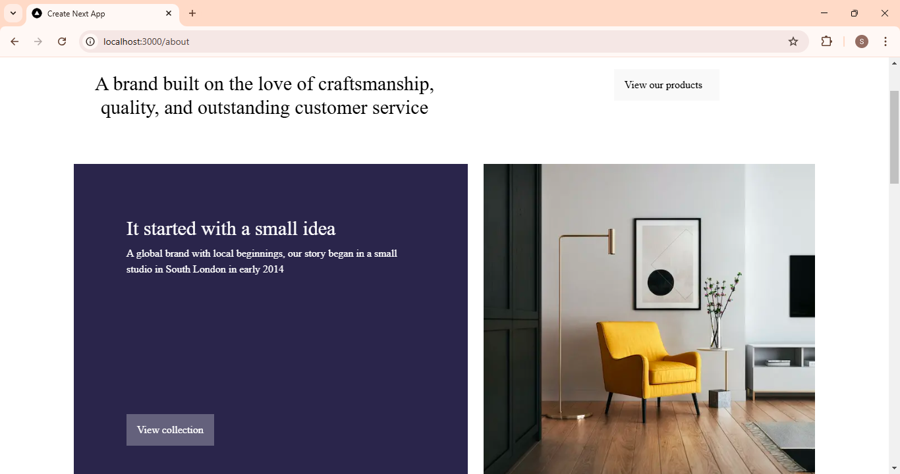

# Avion Application Testing Documentation

## Introduction

This document provides a detailed account of the testing performed on the marketplace application to verify its core functionalities, including handling edge cases. All test cases were thoroughly executed, and the results are recorded for reference.

## Test Objectives

The testing objectives were as follows:

1. Ensure the functionality and accuracy of the product listing page.
2. Assess API error handling mechanisms with `try` and `catch` blocks.
3. Verify the addition and removal of items in the cart.
4. Confirm that the application is responsive on mobile devices.
5. Validate the search functionality by categories and with invalid categories.
6. Test the display and functionality of static pages, including Home, Contact Us, and About Us.

## Detailed Test Case Results

### Test Case TC001: Validate Product Listing Page

**Objective**: Verify that the furniture section displays accurate product details.

**Test Steps**:
1. Open any category page.
2. Verify that all products display on the page.

**Expected Result**: All products should be displayed with accurate details.

**Actual Result**: Products displayed as expected.

**Status**: Passed

**Severity**: Low

**Screenshot**


### Test Case TC002: Test API Error Handling

**Objective**: Verify how the application manages API disconnections using try and catch blocks.

**Code Implementation**:
```javascript
useEffect(() => {
    const fetchProducts = async () => {
      try {
        const query = `
          *[_type == "product"] {
            name,
            "category": category->name,
            slug,
            "imageUrl": image.asset->url,
            price,
            quantity,
            tags,
            description,
            features,
            dimensions {
              height,
              width,
              depth
            },
            dateAdded
          }
        `;
        const data = await client.fetch(query);

        // Extract unique categories
        const uniqueCategories = Array.from(new Set(data.map((product: Product) => product.category))) as string[];
        setCategories(uniqueCategories);

        setProducts(data);
        setFilteredProducts(data);
      } catch (error) {
        console.error("Error fetching products:", error);
      } finally {
        setIsLoading(false);
      }
    };

    fetchProducts();
  }, []);

  // Filter and sort products based on user selection
  useEffect(() => {
    let filtered = products;

    // Filter by category
    if (selectedCategory !== "All") {
      filtered = filtered.filter((product) => product.category === selectedCategory);
    }

    // Sort products
    if (sortOption === "dateAdded") {
      filtered.sort((a, b) => new Date(b.dateAdded).getTime() - new Date(a.dateAdded).getTime());
    } else if (sortOption === "name") {
      filtered.sort((a, b) => a.name.localeCompare(b.name));
    }

    setFilteredProducts(filtered);
  }, [selectedCategory, sortOption, products]);
```

**Test Steps**:
1. Simulate an API disconnection.
2. Refresh the page.
3. Verify whether an error message is displayed.

**Expected Result**: A fallback UI with the message "Unable to load products" should appear.

**Actual Result**: Fallback UI displayed correctly.

**Status**: Passed

**Severity**: Medium

### Test Case TC003: Check Cart Functionality

**Objective**: Confirm the ability to add and remove items from the cart.

**Test Steps**:

1. Add an item to the cart.
2. View the cart.
3. Remove the item from the cart.
4. Verify cart updates.

**Expected Result**: The cart should update with the added or removed products.

**Actual Result**: Cart functionality worked as expected.

**Status**: Passed

**Severity**: High

**Screenshot**


### Test Case TC004: Mobile Responsiveness Validation

**Objective**: Ensure the application adapts correctly to mobile devices.

**Test Steps**:
1. Resize the browser window to simulate a mobile view.2. Test the layout on mobile view.
3. Verify that the layout adjusts appropriately.

**Expected Result**: The layout should adapt seamlessly to smaller screens.

**Actual Result**: Responsive layout performed as intended.

**Status**: Passed

**Severity**: Medium


### Test Case TC005: Category Search Functionality Validation

**Objective**: Verify that products are filtered correctly by category through the search bar.

**Test Steps**:
1. Enter a category name in the search bar.
2. Press Enter to apply the filter.
3. Check that the products are filtered by the specified category.

**Expected Result**: Products should be filtered based on the entered category.

**Actual Result**: Search filter applied correctly.

**Status**: Passed

**Severity**: High


### Test Case TC006: Invalid Category Search Handling

**Objective**: Test the application's response to non-existent categories in the search bar.

**Test Steps**:
1. Enter a non-existent category name in the search bar.
2. Press Enter.
3. Verify the display of an appropriate fallback message.

**Expected Result**: A message stating "No products found" should appear.

**Actual Result**: Fallback UI displayed correctly with the message "No products found."

**Status**: Passed

**Severity**: Low


### Test Case TC007: Validate Home Page Display

**Objective**: Ensure that the home page displays correctly.

**Test Steps**:
1. Open the home page.
2. Verify the layout and content.

**Expected Result**: The home page should display as designed.

**Actual Result**: Home page displayed correctly.

**Status**: Passed

**Severity**: Low


### Test Case TC008: Validate Contact Us Page Display

**Objective**: Ensure that the Contact Us page displays correctly.

**Test Steps**:
1. Open the Contact Us page.
2. Verify the layout and content.

**Expected Result**: The Contact Us page should display as designed.

**Actual Result**: Contact Us page displayed correctly.

**Status**: Passed

**Severity**: Low

### Test Case TC009: Validate About Us Page Display

**Objective**: Ensure that the About Us page displays correctly.

**Test Steps**:
1. Open the About Us page.
2. Verify the layout and content.

**Expected Result**: The About Us page should display as designed.

**Actual Result**: About Us page displayed correctly.

**Status**: Passed

**Severity**: Low



## Results Summary

- **Total Test Cases Executed**: 9
- **Passed Test Cases**: 9
- **Failed Test Cases**: 0

All test cases passed successfully. The application meets the expected behavior for all tested scenarios.

## Conclusion

The marketplace application has undergone extensive testing, covering critical functionalities such as product listing, cart functionality, API error handling, mobile responsiveness, and static pages. The application is robust, user-friendly, and ready for deployment.
